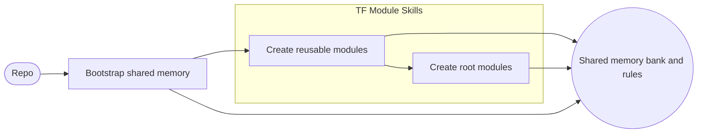

# Terraform Skills for CODEX CLI

Skill bundle for [CODEX CLI](https://github.com/topics/codex-cli) that turns a blank Terraform/AWS repository into a guided, MCP-aware workspace. It provides a reusable memory bank, opinionated workflows, and ready-to-run scripts for designing, testing, and documenting high-quality Terraform AWS modules with minimal boilerplate.



## Features

- **MCP-aware Terraform workspace**  
  Use Model Context Protocol (MCP) servers to stream in AWS, Terraform, and code-search context directly into your CODEX tasks.

- **Persistent memory bank**  
  One-time bootstrap initializes a `memory-bank/` directory with agents and project-specific context so future tasks can reuse past plans, decisions, and constraints.

- **Terraform child module workflows**  
  Guided flows for planning, scaffolding, testing, and documenting Terraform AWS child modules, aligned with the popular `terraform-aws-modules` conventions.

- **Terraform root module workflows**  
  Standards and scripts for planning, composing, validating, and documenting Terraform root modules that integrate child modules with secure defaults.

- **Ready-to-run scripts**  
  Shell scripts for creating modules, examples, plans, tests, and documentation so you can focus on design and correctness instead of boilerplate.

- **Opinionated, repeatable process**  
  Encourages consistent patterns across modules (structure, interfaces, testing, docs) that are easy to scale across teams.

## Repository Structure

This repository contains multiple skills that are meant to be used together as a bundle:

- [`memory-bank-bootstrap`](memory-bank-bootstrap/SKILL.md)  
  Bootstrap scripts and agent definitions for creating and maintaining a project-specific memory bank. This seeds the workspace with context that CODEX can reuse across all Terraform module tasks.
  - Key files:
    - [`memory-bank-bootstrap/SKILL.md`](memory-bank-bootstrap/SKILL.md) – high-level description of the skill
    - [`memory-bank-bootstrap/scripts/create-memory.sh`](memory-bank-bootstrap/scripts/create-memory.sh) – initializes the memory bank for this repo
    - [`memory-bank-bootstrap/scripts/add-agents.sh`](memory-bank-bootstrap/scripts/add-agents.sh) – registers AGENTS rules for this project

- [`tf-child-modules`](tf-child-modules/SKILL.md)  
  Opinionated workflows and scripts that help you plan, scaffold, test, and document Terraform AWS child modules.
  - Key files:
    - [`tf-child-modules/SKILL.md`](tf-child-modules/SKILL.md) – skill overview and usage details
    - [`tf-child-modules/references/`](tf-child-modules/references/) – reference docs on module lifecycle, structure, testing, versioning, etc.
    - [`tf-child-modules/scripts/create-module.sh`](tf-child-modules/scripts/create-module.sh) – scaffold a new module
    - [`tf-child-modules/scripts/create-examples.sh`](tf-child-modules/scripts/create-examples.sh) – generate examples for a module
    - [`tf-child-modules/scripts/create-documentation.sh`](tf-child-modules/scripts/create-documentation.sh) – generate documentation
    - [`tf-child-modules/scripts/test-module.sh`](tf-child-modules/scripts/test-module.sh) – run tests for a module

- [`tf-root-module`](tf-root-module/SKILL.md)  
  Standards and scripts for planning, composing, validating, and documenting Terraform root modules that integrate child modules with secure defaults.
  - Key files:
    - [`tf-root-module/SKILL.md`](tf-root-module/SKILL.md) – skill overview and usage details
    - [`tf-root-module/references/`](tf-root-module/references/) – reference docs on root module design, structure, and testing
    - [`tf-root-module/scripts/root-module.sh`](tf-root-module/scripts/root-module.sh) – scaffold a new root module
    - [`tf-root-module/scripts/plan.sh`](tf-root-module/scripts/plan.sh) – create a required change plan
    - [`tf-root-module/scripts/test.sh`](tf-root-module/scripts/test.sh) – test root module examples

The top-level [`LICENSE`](LICENSE) applies to the content in this repository.

## Prerequisites

Before using these skills, ensure you have:

- **Terraform** (compatible with the AWS modules you intend to use)
- **AWS account** with credentials configured locally (e.g., via `aws configure` or environment variables)
- **CODEX CLI** installed and available on your `PATH`
- **MCP-capable environment** (CODEX configured to talk to MCP servers)
- **Tooling** installed `tflint`, `tfsec`, `rg`, `yq` (It is optional, but it is recommended to use loclastack.)

You should be comfortable with:

- Basic Terraform usage (init/plan/apply)
- AWS IAM and resource management
- Running shell scripts on your platform (macOS, Linux, or WSL)

## Installation

### 1. Install CODEX CLI

Follow the official CODEX CLI installation documentation for your platform and verify it is available:

```bash
codex --help
```

If the command prints help output, CODEX is correctly installed and on your `PATH`.

### 2. Obtain this skill bundle

Clone this repository into a location where you manage your CODEX skills:

```bash
git clone https://github.com/senad-d/terraform-skills.git && \
    cd terraform-skills && \
    [ -d "$HOME/.codex" ] && \
    cp -R memory-bank-bootstrap tf-child-modules tf-root-module "$HOME/.codex"/ || echo 'Error: $HOME/.codex does not exist or clone failed'
```

### 3. Register the skills with CODEX

Follow the CODEX CLI documentation for registering local skills. In most setups, you will:

- Point CODEX to this repository as a skill bundle
- Reference the skills by name (for example, `$memory-bank-bootstrap`, `$tf-child-modules`, and `$tf-root-module`) in your tasks

Refer to [`memory-bank-bootstrap/SKILL.md`](memory-bank-bootstrap/SKILL.md), [`tf-child-modules/SKILL.md`](tf-child-modules/SKILL.md), and [`tf-root-module/SKILL.md`](tf-root-module/SKILL.md) for skill-specific integration details.

## Configuration

To get the most out of this bundle, configure your CODEX MCP servers so tasks can leverage rich context from AWS, Terraform, and external documentation.

### Recommended MCP servers

- **context7** – general-purpose context and code search: <https://context7.com/>
- **terraform-mcp-server** – Terraform-specific knowledge and helpers: <https://github.com/hashicorp/terraform-mcp-server>
- **aws-knowledge-mcp-server** – AWS documentation and service knowledge: <https://awslabs.github.io/mcp/servers/aws-knowledge-mcp-server/>

### Example CODEX MCP configuration

Add the following MCP configuration to your CODEX CLI configuration file (commonly `config.toml`):

```toml
[mcp_servers.context7]
command = "npx"
args = ["-y", "@upstash/context7-mcp", "--api-key", "API_KEY_HERE"]
startup_timeout_sec = 20.0

[mcp_servers.terraform-mcp-server]
command = "uvx"
args = ["awslabs.terraform-mcp-server@latest"]
startup_timeout_sec = 20.0

[mcp_servers.aws-knowledge-mcp-server]
command = "uvx"
args = ["fastmcp", "run", "https://knowledge-mcp.global.api.aws"]
```

Notes:

- Replace `API_KEY_HERE` with your actual Context7 API key.
- Ensure `npx` and `uvx` (from [uv](https://github.com/astral-sh/uv)) are available on your `PATH`.
- Restart CODEX CLI or reload its configuration after updating the file.

## Usage

Typical workflow for a new Terraform/AWS module project:

### 1. Bootstrap the memory bank

Run the memory bank bootstrap skill once per repository/workspace to seed project-specific context.

```bash
codex
```

Use skill: `$memory-bank-bootstrap`

This sets up the `memory-bank/` directory and AGENTS rules that CODEX can reuse across subsequent tasks.

After the memory bank is created, a `Rules/` directory is added at the root of this repository. The `$tf-child-modules` and `$tf-root-module` skills automatically read any files in this directory as additional, project-specific rules, in addition to the default rules they ship with.

### 2. Create and evolve Terraform AWS child modules

Use the `tf-child-modules` skill to plan, scaffold, and refine child modules. For example, in CODEX you might start a task like:

```text
new task -> create aws module for cloud-map using $tf-child-modules
```

Behind the scenes, CODEX can leverage scripts such as:

- [`tf-child-modules/scripts/create-module.sh`](tf-child-modules/scripts/create-module.sh)
- [`tf-child-modules/scripts/create-examples.sh`](tf-child-modules/scripts/create-examples.sh)
- [`tf-child-modules/scripts/create-plan.sh`](tf-child-modules/scripts/create-plan.sh)
- [`tf-child-modules/scripts/test-module.sh`](tf-child-modules/scripts/test-module.sh)
- [`tf-child-modules/scripts/create-documentation.sh`](tf-child-modules/scripts/create-documentation.sh)

These workflows encourage consistent module structure, testing, and documentation aligned with `terraform-aws-modules` best practices.

### 3. Compose Terraform root modules

Use the `tf-root-module` skill to plan and assemble root modules that compose multiple child modules. For example:

```text
new task -> create root module for shared networking using $tf-root-module
```

Typical scripts include:

- [`tf-root-module/scripts/root-module.sh`](tf-root-module/scripts/root-module.sh)
- [`tf-root-module/scripts/plan.sh`](tf-root-module/scripts/plan.sh)
- [`tf-root-module/scripts/test.sh`](tf-root-module/scripts/test.sh)

### 4. Iterate with memory-backed context

As you create modules, the memory bank accumulates:

- Architectural decisions
- Constraints and non-functional requirements
- Naming and tagging conventions
- Testing and rollout strategies

Subsequent CODEX tasks (for example, refactoring an existing module or adding a new one) can reuse this context automatically, reducing duplication and helping maintain consistency across your Terraform codebase.

## Development

If you want to extend or customize these skills:

1. Clone this repository and create a new branch.
2. Modify the relevant skill definitions and scripts under `memory-bank-bootstrap/`, `tf-child-modules/`, or `tf-root-module/`.
3. Test locally by pointing your CODEX workspace at your modified checkout.

Refer to the individual [`SKILL.md`](memory-bank-bootstrap/SKILL.md) files for implementation details and conventions.

## Contributing

Contributions are welcome. Common contribution paths include:

- Improving documentation and examples
- Adding new workflows or scripts for common Terraform/AWS patterns
- Enhancing support for additional MCP servers or context sources

Please open an issue or pull request in this repository with a clear description of the change and rationale.

## License

This project is licensed under the terms described in [`LICENSE`](LICENSE).
