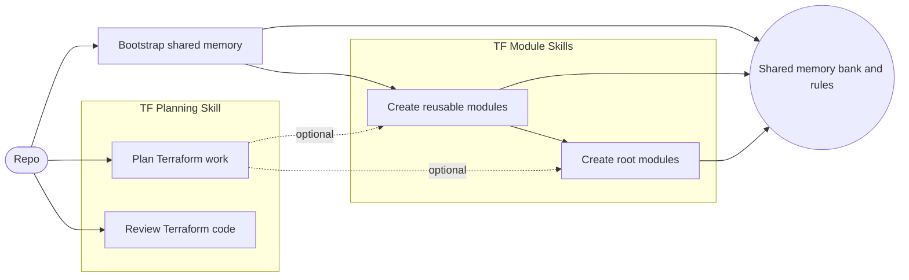
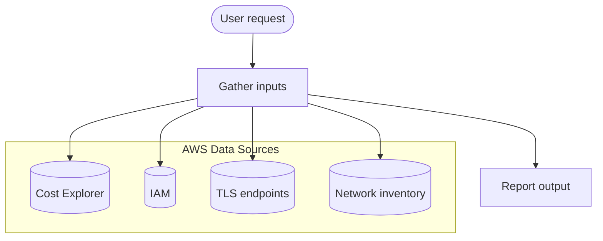

# Terraform Skills

Skill bundle for [CODEX CLI](https://github.com/topics/codex-cli) that packages Terraform workflows plus an AWS reporting skill: bootstrap a reusable memory bank, plan changes, create child modules, compose root modules, run evidence-based reviews, and generate AWS account reports. Each skill comes with strict gates, templates, and scripts that drive consistent planning, validation, and documentation. The benefit is faster, more reliable Terraform AWS delivery with shared context and guardrails that reduce rework and keep standards consistent across teams.

Skils pipeline:



AWS Info pipeline:



## Features

- **MCP-aware Terraform workspace**
  Use Model Context Protocol (MCP) servers to stream in AWS, Terraform, and code-search context directly into your agent tasks.

- **Persistent memory bank**
  One-time bootstrap initializes a `memory-bank/` directory with agents and project-specific context so future tasks can reuse past plans, decisions, and constraints.

- **Terraform child module workflows**
  Guided flows for planning, scaffolding, testing, and documenting Terraform AWS child modules.

- **Terraform root module workflows**
  Standards and scripts for planning, composing, and validating Terraform root modules that integrate child modules with secure defaults.

- **Terraform planning workflows**
  Structured planning for new modules, edits, or AWS architecture changes without touching code, with clear inputs and plan outputs.

- **Terraform review workflows**
  Structured Terraform code review guidance focused on security, reliability, cost, and correctness with strict evidence requirements.

- **AWS account reporting**
  Generates a consolidated AWS report for cost, IAM, TLS, and network snapshots.

- **Ready-to-run scripts**
  Shell scripts for creating modules, examples, plans, tests, and documentation so you can focus on design and correctness instead of boilerplate.

- **Opinionated, repeatable process**  
  Encourages consistent patterns across modules (structure, interfaces, testing, docs) that are easy to scale across teams.

## Prerequisites

Before using these skills, ensure you have:

- **Terraform** (compatible with the AWS modules you intend to use)
- **AWS account** with credentials configured locally (e.g., via `aws configure` or environment variables)
- **AWS CLI profile configured** (required for the `aws-info` skill)
- **CODEX CLI** installed and available on your `PATH`
- **MCP-capable environment** (CODEX configured to talk to MCP servers)
- **Tooling** installed `tflint`, `tfsec`, `rg`, `yq` (It is optional, but it is recommended to use loclastack.)

You should be comfortable with:

- Basic Terraform usage (init/plan/apply)
- AWS IAM and resource management
- Running shell scripts on your platform (macOS, Linux, or WSL)

## Installation

### Obtain this skill bundle

Clone this repository into a location where you manage your CODEX skills:

```bash
git clone https://github.com/senad-d/terraform-skills.git 

cd terraform-skills && [ -d "$HOME/.codex" ] && \
cp -R aws-info memory-bank-bootstrap tf-child-modules tf-root-module tf-review tf-plan "$HOME/.codex"/ || echo '$HOME/.codex does not exist'
```

## Configuration

To get the most out of this bundle, configure your tooling and CODEX MCP servers so tasks can leverage rich context.

### Recommended tools

- Localstack for testing:

```bash
docker run \
  --rm -it \
  -p 127.0.0.1:4566:4566 \
  -p 127.0.0.1:4510-4559:4510-4559 \
  -v /var/run/docker.sock:/var/run/docker.sock \
  localstack/localstack
```

- AWS credentials:

```bash
[localstack]
region = us-east-1
output = json
aws_access_key_id = AKIATESTKEY1234567890
aws_secret_access_key = ABCDEFGHIJKLMNOPQRSTUVWX
endpoint_url = http://localhost:4566
```

### Recommended MCP servers

- **terraform-mcp-server** – Terraform-specific knowledge and helpers: <https://github.com/hashicorp/terraform-mcp-server>
- **aws-knowledge-mcp-server** – AWS documentation and service knowledge: <https://awslabs.github.io/mcp/servers/aws-knowledge-mcp-server/>

### Example CODEX MCP configuration

Add the following MCP configuration to your CODEX CLI configuration file (commonly `config.toml`):

```toml
[mcp_servers.terraform-mcp-server]
command = "uvx"
args = ["awslabs.terraform-mcp-server@latest"]
startup_timeout_sec = 20.0

[mcp_servers.aws-knowledge-mcp-server]
command = "uvx"
args = ["fastmcp", "run", "https://knowledge-mcp.global.api.aws"]
```

Notes:

- Ensure `npx` and `uvx` (from [uv](https://github.com/astral-sh/uv)) are available on your `PATH`.
- Restart CODEX CLI or reload its configuration after updating the file.

## Usage

Typical workflow for a new Terraform/AWS module project:

### 1. Bootstrap the memory bank

Run the memory bank bootstrap skill once per repository/workspace to seed project-specific context.

```bash
$memory-bank-bootstrap
```

This sets up the `memory-bank/` directory and AGENTS rules that CODEX can reuse across subsequent tasks.

After the memory bank is created, a `Rules/` directory is added at the root of this repository. The skills automatically read any files in this directory as additional, project-specific rules, in addition to the default rules they ship with.

> Note: The memory bank is optional, but recommended for larger projects.

> Recommendation: To ensure the memory bank is used, start your prompt with `new task ->`.

### 2. Plan Terraform work

Use the `tf-plan` skill to create a structured plan for new modules, edits, or architecture updates without changing code. For example:

```text
$tf-plan
```

### 3. Create Terraform AWS child modules

Use the `tf-child-modules` skill to plan, scaffold, and refine child modules. For example, in CODEX you might start a task like:

```text
Create aws module for vpc using $tf-child-modules
```

These workflows encourage consistent module structure, testing, and documentation aligned with `terraform-aws-modules` best practices.

### 4. Compose Terraform root modules

Use the `tf-root-module` skill to plan and assemble root modules that compose multiple child modules. For example:

```text
Create module for shared networking using $tf-root-module
```

### 5. Perform Terraform reviews

Use the `tf-review` skill to run structured reviews that require evidence and remediation steps. For example:

```text
Review module for iam-user using $tf-review
```

### 6. Generate AWS account reports

Use the `aws-info` skill to generate consolidated AWS reports for Cost, IAM, TLS, and Network inventory. 
> This skill requires a configured AWS CLI profile.

```text
$aws-info
```

## Contributing

Contributions are welcome. Common contribution paths include:

- Improving documentation and examples
- Adding new workflows or scripts for common Terraform/AWS patterns
- Enhancing support for additional MCP servers or context sources

Please open an issue or pull request in this repository with a clear description of the change and rationale.

## License

This project is licensed under the terms described in [`LICENSE`](LICENSE).
