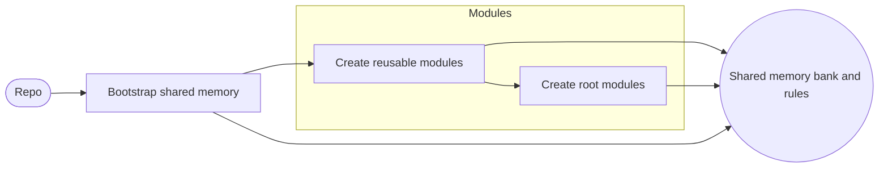

```mermaid
flowchart LR
    %% Terraform skills memory bank workflow

    A([Repo]) --> B[Bootstrap shared memory]
    B --> C[Create reusable modules]
    C --> D[Create root modules]

    subgraph Modules
        C
        D
    end

    MB((Shared memory bank and rules))

    C --> MB
    D --> MB
    B --> MB

```